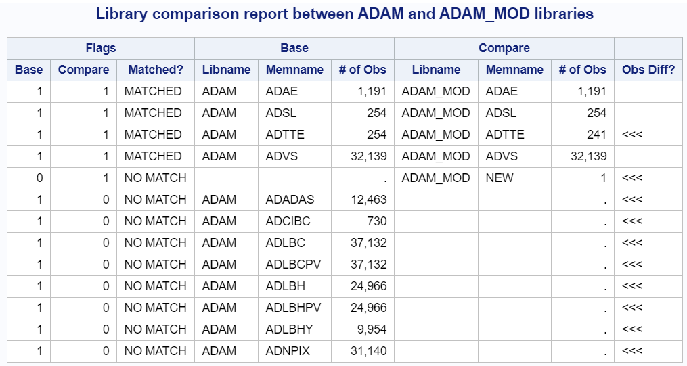

# How to use Open Source SAS Macros? COMPARE as example!

## 1. Seach for related macros

Search in the Open Source Portal for specific macros, e.g. search for "compare" in macro descriptions ([link](https://www.glacon.eu/portal/#/scripts)).

Tool | Macro | Description
--- | --- | ---
SAS Macros by Scott Bass | compare | PROC COMPARE either two datasets or two libraries
Roland's SAS® Macros | complibs | To "proc compare" identically-named datasets in two libraries
Roland's SAS® Macros | compvars | To compare the differences in variables present in two datasets and report the results to global macro variables.


## 2. Download & Setup

- Download complete git repository from Scott Bass
- Download zip file for Roland's SAS® Macros and unzip
- Checkout required sub-macros
- Think about macro setup 
    - Options
        - Include of all macros / submacros
        - Using SASAUTOS
        - Creating macro catalog
    - What if the same names available?
        - Rename all macros? "Tool"-prefix? 
        - Set & Reset for every macro?
- Test environment
    - need data and libraries with differences

## 3. Prepare environment

- create example dataset(s)
- include the macros in SASAUTOS

``` 
    OPTIONS SASAUTOS = ("<path1>", "<path2>" , SASAUTOS);
    OPTIONS MRECALL;
```

Otherwise you might
- perform "include" of all macros

``` 
    filename mymacs "<path>";
    %include mymacs('*.sas');
```

 | ONLY IF YOU ARE SURE THAT THESE ARE ONLY MACROS AND YOU TRUST THEM
--|--

**Issues in Roland's SAS® Macros**

- contains a "program" instad of macro
- remove this (datanulldemo.sas)

## 4. Checkout Macro "compvars"

- checkout the header for example / usage

```
/ Usage     : %let ds1=dataset1;
/             %let ds2=dataset2;
/             %compvars(&ds1,&ds2)
/             options nosource;
/             %put NOTE: Variables found in &ds1 but not &ds2:;
/             %put &_left_;
/             %put NOTE: Variables found in &ds2 but not &ds1:;
/             %put &_right_;
/             %put NOTE: Variables found in both &ds1 and &ds2:;
/             %put &_both_;
```

- using prepared example data for the datasets 
    - `%let ds1=adam.adtte;`
    - `%let ds1=adam_mod.adtte;`

Now the fun starts:

```
 ERROR: File ADAM_MOD.ADDTE.DATA does not exist.
```

Next Steps:

- check to modify the call
- check the documentation or
- check the source


Copy the datasets to the work library: 

- `%let ds1=adtte;`
- `%let ds1=adtte_mod;`

The result is now as expected:

```
Variables found in addte but not addte_mod:
SAFFL
Variables found in addte_mod but not addte:
newvar
Variables found in both addte and addte_mod:
ADT AGE AGEGR1 AGEGR1N AVAL CNSR EVNTDESC PARAM PARAMCD RACE RACEN SEX SITEID SRCDOM SRCSEQ SRCVAR STARTDT STUDYID TRTA TRTAN TRTDUR TRTEDT TRTP TRTSDT USUBJID
```

## 5. Checkout Macro "complibs"

- checkout the header for example / usage

```
/ Usage     : %complibs(base,comp)
/
/===============================================================================
/ PARAMETERS:
/-------name------- -------------------------description------------------------
/ libold            (pos) Libref of old library or path name enclosed in quotes.
/ libnew            (pos) Libref of new library or path name enclosed in quotes.
/ sortvars          (optional) List of variables separated by spaces that you
/                   would use to sort the datasets to obtain uniqueness. If left
/                   blank then the current sort order is used.
/ dfsortvars        (options) Default sort variables to use if none defined to
/                   sortvars= and no current sort variables detected for a
/                   dataset.
/ direct=no         By default, do not do a one to one obs comparison. Overrides
/                   sort variable parameters if set to yes. Use this is your
/                   datasets should be exactly the same.
/ options           Options for "proc compare". "listall" is the default.
/ chardiff=no       (unquoted) By default, do not show detailed character field
/                   differences.
/ dslist            Optional list of datasets to compare that you know exist in
/                   both libraries.
/ titlenum=1        Start title number
```

- using prepared example data for the datasets 
    - `%complibs(adam,adam_mod);`

Now the fun starts:

```
ERROR: (complibs) No sort variable list determined for dataset ADAE
ERROR: (complibs) No sort variable list determined for dataset ADSL
ERROR: (complibs) No sort variable list determined for dataset ADTTE
ERROR: (complibs) No sort variable list determined for dataset ADVS
```

Next Steps:

- check to modify the call
- check the documentation or
- check the source

When checking the parameter documentation, we either should pre-sort the datasets or use the sortvars option.
- `%complibs(adam,adam_mod, sortvars=usubjid);`

*sortvars - (optional) List of variables separated by spaces that you would use to sort the datasets to obtain uniqueness. If left blank then the current sort order is used.*

By working with SASAUTOS or including the Rowland tool as last, you will see the resulting PROC COMPARE outputs.

If you had ben working with INCLUDE statements, you will get issues:
```
ERROR: File WORK.NAME.DATA does not exist.
...
ERROR: (complibs) No sort variable list determined for dataset ADAE
```

This issue is a conflict due to the inclusion of the macros of the second toolkit. When including the macros from Rowland only (or as last step), then the macro runs just fine apart from two warnings. The resulting PROC COMPARE outputs can be checked. 

When working with SASAUTOS, the issue is not available, as the naming conflict only appears when some specific macros are included. In general it makes sense to either initialize just one toolkit at a time or rename all macros. You might want to check for naming conflicts first.

Checkout the notes in the header for additional information about the different options and behavior of the macro.


## 6. Checkout Macro "compare"

- checkout the header for example / usage

```
%compare(base=base,comp=comp,by=name)
%compare(base=lib_base, comp=lib_comp)
%compare(base=lib_base, comp=lib_comp, filter=cla*|shoes)
```

- checkout compare of two datasets
    - `%compare(base=adam.adtte,comp=adam_mod.adtte,by=usubjid)`

We get the PROC COMPARE output, as well as information in the log about the differences:
```
 WARNING: Data set SPDEWORK._BASE_ contains 1 variables not in SPDEWORK._COMP_.
 WARNING: Data set SPDEWORK._COMP_ contains 1 variables not in SPDEWORK._BASE_.
 WARNING: Data set SPDEWORK._BASE_ contains 14 observations not in SPDEWORK._COMP_.
 WARNING: Data set SPDEWORK._COMP_ contains 1 observations not in SPDEWORK._BASE_.
 WARNING: Werte der folgenden 2 Variablen unterscheiden sich: RACE AVAL 
 WARNING: The data sets SPDEWORK._BASE_ and SPDEWORK._COMP_ contain unequal values.
```

- checkout compare of two libraries
    - `%compare(base=adam,comp=adam_mod,by=usubjid)`

Result window shows a great overview of the resulting compare:



PROC COMPARE results are available as well. There are also warnings in the log, but as these are very unspecific (e.g. SPDEWORK.\_BASE\_) it is not obvious for which dataset these belong to.

## 7. Glances at the code

After checking the functionality, the source code might be looking interesting as well. Especially for learning how to create macros it is very beneficial to checkout how other did it.

All code examples has a very nice header which allows to quickly find out how to use the macro and what the parameters mean. Such a documentation is essential for open source solutions to allow others a quick learning curve when it comes to usage. Additional in-source documentation is great to allow an easy learning of what specific code blocks do before checking them in detail.

Let's compare the two styles!

|  | Rowland's SAS macros | Macro from Scott Bass |
| --- | --- | --- |
|Purpose|utility library mainly used by the developer, made available as open source | utilities specifically updated to be optimized for open source usage
| Checks | less checks | detailed checks |
| Header | user-friendly with example(s) | user-frienldy with example(s) |
| In-Source-Comments | for complex macros | more comments |

## 8. Summary

It is easy with the portal to find specific macros if available and check the functionality. As typicall when using other peoples program, it might be easy and intuitive or there might be some hurdles to take.

What is important when creating open source SAS macros?
- Use speaking macro and parameter names
- Use a header containing major information and parameter description
- Include comments in your code
- Ideally include error handling
- Checkout Good Programming practices from [PhUSE collaboration](https://www.phusewiki.org/wiki/index.php?title=File:GPP_Guidance_Document_v1.1.docx)

Why do people use open source
- For easy available functionality
- For learning purposes
- To adopt for own purposes